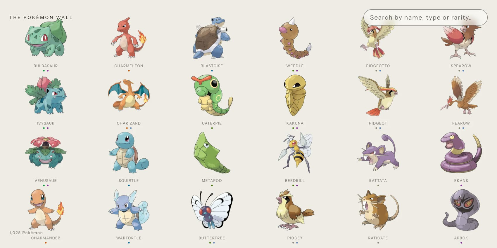

# The Pokémon Wall

Every Pokédex I could find online is dense, cramped and joyless: a table or a
grid of small cards, built to be queried rather than looked at. Pokémon artwork
is beautiful, and none of them treat it that way.

So this is one built the other way round. All 1,025 Pokémon sit on a single
wall you scroll sideways through. The ends of the wall bend away from you in
proportion to how fast you are moving, so it reads as a surface being pushed
rather than a list being scrolled. Hovering a Pokémon leaves its whole
evolution family in colour and lets everything else fall away to grey.
Searching sweeps the wall across to the results instead of blanking and
redrawing them. Opening one expands the artwork itself rather than covering it
with a modal.

Search by name, type or rarity, and open any Pokémon for its real stats,
height, weight, typing, evolution family and Pokédex entry.

**[Open the live site →](https://the-pokemon-wall.vercel.app/)**



---

## Running it

Requires Node 20.19+ or 22.12+ and pnpm.

```bash
pnpm install
pnpm dev
```

The API is an Express app mounted as Vite middleware, so `pnpm dev` serves both.
`pnpm build`, `pnpm test` and `pnpm lint` do what you would expect.

---

## How it works

The whole wall is one WebGL canvas. `wall/scene.ts` is the bulk of it, at
around 950 lines of code: one object owning one scene, its meshes and the
per-frame state several passes share. The pieces that separate cleanly already
have — the shader source, the layout maths, and the React lifetime.

```
src/
├── wall/            the WebGL wall
│   ├── scene.ts     the three.js scene: tiles, sweep, warp, input
│   ├── layout.ts    tile size, gaps and rows for a viewport (pure)
│   ├── shaders.ts   the two GLSL programs
│   └── useWallScene.ts   its React lifetime, and the scroll extent
├── components/      chrome, expanded card, accessibility mirror
├── hooks/           search with debounce and request supersession
└── lib/pokemon.ts   types, colour ramps, formatting
server/ + api/       one query implementation, two entry points
```

A few things worth knowing:

- **One query implementation, two entry points.** `server/query.ts` holds the
  search and pagination. Express serves it in development; the same function is
  deployed as a serverless function in production, because a built site is
  static files with no server behind it.
- **The data is real.** Official artwork, real typing, base stats, height,
  weight, evolution families and Pokédex entries, fetched from PokéAPI by
  `scripts/generate-pokemon.mjs`. Nothing is generated.

### The shader

The bend is why this is WebGL rather than CSS. A transform can tilt a
rectangle, but it cannot bend what is drawn inside one. So every Pokémon is a
plane subdivided into a 24×24 grid of vertices, and the vertex shader moves
each of those vertices individually — which is what lets the artwork itself
curve instead of staying flat on a tilted card.

The curve is one line of maths. Each vertex's horizontal position is normalised
to `-1…1` across the screen, and then displaced by `sign(nx) * pow(abs(nx),
falloff)`. Raising it to a power keeps the middle of the wall flat and makes
the displacement bite only near the edges. Taking the sign makes the function
*odd*, so the two ends travel in opposite directions: the left edge sinks away
from you, the right edge rises toward you. An even function would push both
edges the same way and the wall would read as a cylinder; the odd one reads as
a surface being turned. How far it bends is driven by scroll velocity, so the
wall flexes when you throw it and settles flat when it stops.

Two details do most of the work of making it feel solid. The curve is sampled
twice — once per vertex, which bends the artwork, and once per tile centre,
which moves the tile as a whole — so tiles stay coherent while their contents
curve. And because moving a tile toward the camera would also make it appear
larger, the shader computes that perspective gain and divides it back out, so
the grid keeps even spacing no matter how far the ends have travelled.

Opening a Pokémon runs through the same shader: the selected tile grows and
glides to the centre while every other tile is pushed radially away from the
point you clicked, with tiles nearest it shoved hardest on an exponential
falloff, so the wall opens outward like a shockwave rather than sliding aside.
Dimming is in the fragment stage, desaturating toward luminance rather than
fading to grey, which keeps a Pokémon's silhouette readable while its colour
drops away.

Searching moves the wall rather than repainting it. The outgoing results travel
off one side while the incoming ones arrive from the other, so a search reads
as the wall moving to a different part of itself; clearing the search sends it
back the way it came. The wall waits to leave until most of the incoming tiles
have their artwork, so it never travels to an empty panel, and gives up waiting
after eight hundred milliseconds if the network is slow. Typing another letter
mid-flight extends the journey instead of restarting it, which is what makes a
run of keystrokes read as one continuous movement. The curve is a near relative
of the scroll's own easing, with a softer opening — a scroll starts from your
hand already moving, and a sweep starts from rest.

### Keeping it usable

A canvas is a hole in the accessibility tree. Its pixels cannot be focused,
read out or found by a screen reader, so a wall built this way starts out
completely unusable for anyone not using a mouse. The fix is to render the same
1,025 Pokémon a second time as real buttons, visually hidden but present in the
tree, and let that list drive the canvas.

That mirror is the keyboard interface. It carries one tab stop rather than a
thousand, using a roving tabindex, so Tab enters the wall and arrow keys move
within it. Each entry declares its position in the full set — `aria-setsize` is
1,025, not the 60 currently loaded — so a screen reader says "6 of 1,025"
rather than lying about the page. Moving focus scrolls the wall to that
Pokémon, draws a focus ring over the canvas for sighted keyboard users, and
loads more results as focus nears the end, because arrow keys are a screen
reader's version of scrolling. A live region announces result counts as
searches resolve. Enter runs exactly the code a click does.

The same list is the fallback when WebGL is unavailable: rather than paint a
blank page, the mirror is shown for real and you get a plain searchable list of
every Pokémon. Reduced motion is honoured at every point that moves — the warp,
the sweep, the scatter, the scroll easing — leaving cross-fades in place of
movement. Type colours run on two ramps, one meeting 4.5:1 for text and a more
saturated one at 3:1 for the dots, computed against the background rather than
guessed at.

### Keeping it fast

The wall holds 1,025 textured planes, so most of the work is in not doing work.
React is not in the render loop at all: the scene owns its own
`requestAnimationFrame`, and state only crosses into React when something
discrete happens, like a hover changing or the end being reached. Meshes are
built at most twelve per frame, because building a whole page at once stalled
the frame that ingested it and the stall was charged against a live scroll.
Smoothing is normalised against real frame time, so the wall decelerates
identically at 60Hz and 120Hz.

Artwork is the real payload. Tiles render around 130px but the source art is
475px PNG at roughly 141KB, which would be 8.3MB for a first screen of sixty.
They are requested through a resizing proxy at 320px WebP instead, about 17KB
each — a little over 1MB — and the full-size original is swapped in only for
the one tile that expands. Pages of sixty load as the wall approaches its tail,
with a runway of scrollable space ahead of the loaded tiles so a fast fling
never hits a wall while the next page is in flight.

---

## Licence and attribution

The source in this repository is MIT licensed — see [LICENSE](LICENSE).

Pokémon and all related names, characters and artwork are trademarks of
Nintendo, Creatures Inc. and GAME FREAK Inc. This is an unofficial,
non-commercial fan project with no affiliation to, endorsement by, or
sponsorship from any of them.

Pokémon data comes from [PokéAPI](https://pokeapi.co) and the
[Pokémon 3D API](https://github.com/Pokemon-3D-api). Official artwork is loaded
at runtime from PokéAPI's sprite repository rather than redistributed here.
[Instrument Sans](https://fonts.google.com/specimen/Instrument+Sans) is used
under the SIL Open Font License.
